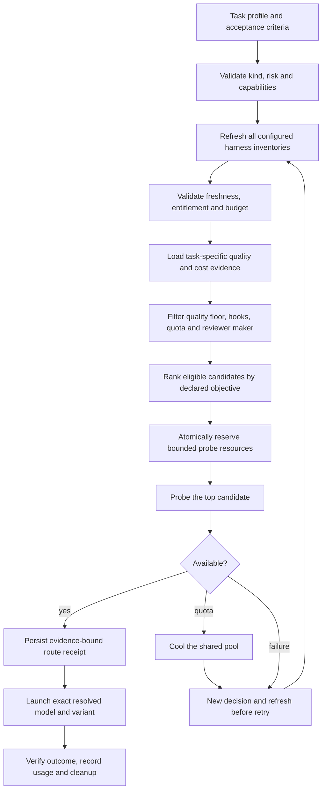

# Automatic task and model selection

Status: proposed implementation contract, 2026-10-09. Current runtime uses ordered chains; the classifier, discovery adapters and scorer below are not implemented. This design replaces manual chain/model selection in an explicit automatic prepare path; existing guarded launch, cooldown, budget and cleanup boundaries remain mandatory. No additional dependencies are required.

## Coordinator input and deterministic classification

The coordinator reads the acceptance criteria, planned files, required tools and current model-ledger evidence. It submits a structured task profile bound to the contract/spec hash: kind, worker/review phase, claimed risk, required capabilities, expected context and rationale. The coordinator cannot supply a preferred model or reduce risk to obtain a cheaper model.

Example coordinator input (schema proposal, not a working CLI flag):

```json
{"phase":"worker","kind":"backend","risk_flags":["authorization"],"required_capabilities":["repository-edit","tests"],"rationale":[{"path":"src/auth.go","reason":"Changes authorization decisions"}]}
```

Reuse ledger kinds `backend`, `frontend`, `fullstack`, `docs`, `mechanical`; reviewing a backend task keeps kind=backend and uses phase=review. Rein validates classification against planned paths, spec requirements and project-sensitive rules. Missing/conflicting classification produces `classification_required`; unknown paths/risk cannot become a cheap mechanical task. A declared mechanical task requires a bounded operation and objective acceptance checks; substantive feature work does not qualify.

| Validated task | Worker candidate policy |
| --- | --- |
| Security-sensitive, production data or other T3 scope | high-risk |
| Backend logic or migrations | backend |
| UI/browser work | frontend |
| Documentation | docs |
| Bounded repetitive operations | mechanical |
| Cross-stack feature or general glue | ordinary |

Use `tier.EvaluateFromAllowGlobs` and `EvaluateFromChangedFiles` to enforce the project-sensitive minimum tier; actual changes can escalate it. Policy also checks required tools, modalities, context, sandbox/hook support and model capabilities. Static path rules do not claim to understand every semantic security risk; uncertain classification stops for refinement by the coordinator. Review uses a maker-independent approved candidate policy and actual worker model identity. Harness identity alone is insufficient: Claude through Kiro is still Anthropic.

## Refresh before every selection

Every automatic prepare, retry or fallback begins a new decision ID and invokes discovery for each configured harness/account/project. A previous decision snapshot cannot authorize a new selection. Metadata adapters may run concurrently; they do not infer against every model. Record adapter/executable version, scope fingerprint, query time, upstream evidence time or unknown, source/hash, complete/partial status, model IDs/variants, capabilities, billing mode, native units and observed limits. Never store credentials in artifacts.

A new local query is not proof of a remotely refreshed catalog. Explicitly distinguish `remote_verified`, `client_catalog` and `unknown`; automatic policy must declare which freshness class it accepts. Revalidation with a provider-supported cache validator is acceptable; a failed refresh must not silently reuse a prior snapshot. Exclude the failed/unproven harness, continue with other freshly eligible harnesses, and stop if none meet the policy. Cached prices/quality may be revalidated within their stated evidence lifetime, but their timestamps must not be replaced with discovery time. Expired quality requires reevaluation, not a metadata-only timestamp update.

| Harness | Adapter surface | Required boundary |
| --- | --- | --- |
| Codex | Version-matched app-server `model/list`, full pagination; `account/rateLimits/read` | Account/client scope; no documented forced remote catalog refresh. Close owned app-server after collection. |
| Claude Code | Version-matched `/model` or documented account-scoped equivalent, if accessible without inference | Anthropic API catalog is not Claude-plan entitlement. No unattended complete catalog adapter was verified locally. Unsupported freshness excludes this harness from strict auto mode until resolved. |
| agy | `agy models`; documented `/usage` refresh where supported | Current models command does not prove remote catalog freshness; interactive quota access needs a bounded adapter and cleanup. |
| Kiro | Installed `kiro-cli chat --list-models --format json` | Preserve account/region governance, context and credit multiplier; unknown remaining balance stays unknown. |
| OpenCode V2 | Version-matched location-scoped `/api/model` or installed `opencode models` | Public/configured catalog is not proof all models are enabled or usable by this account. V1 refresh flags are unsupported on installed V2. |

Discovery never opens paid overages, changes account/default model, purchases credits or executes instructions embedded in catalog text. A small selected-candidate availability probe may run only within an explicit probe budget; it proves that candidate's usability, not completeness or freshness of the whole catalog. Refresh adapters own and close exactly the sessions/processes they create on success, error and cancellation.

## Quality score and eligibility

Quality is task-specific evidence, not a marketing/model-name rank. Key it by exact resolved model/version, harness configuration, effort, tools/context regime, task kind/risk, evaluation-suite version and provenance. Do not carry a predecessor's score to a new model or an unresolved alias. An `auto` model cannot serve as an exact reviewer identity.

For workers, a successful attempt requires objective acceptance gates plus an exact-revision independent review, no unresolved high/blocker, no false completion claim or contract drift. Track all settled attempts, including failed and repaired ones; count verified successes, not only approved rows. Missing outcomes/findings remain unknown and reduce evidence coverage. A successful `OK` availability probe supplies no quality evidence.

Display `Q = 100 * lower95(successes, complete_attempts)`, using the lower endpoint of a two-sided 95% Wilson interval (z=1.959963984540054) and exposing sample count, coverage, confidence and age. Insufficient samples or coverage produces `unqualified`, not Q=100 or Q=0. Reuse the configured quality floor and false-claim limit; make missing floors/configuration explicit rather than inventing model scores. Quality configuration must work without a spending-cap configuration.

The worker interval is `(p + z*z/(2*n) - z*sqrt(p*(1-p)/n + z*z/(4*n*n))) / (1 + z*z/n)`, with p=successes/n; n=0 is unqualified. Automatic policy requires explicit minimum complete attempts, evidence maximum age and `min_approval_rate` in (0,1]. Compare the interval endpoint to that rate; the displayed Q is percent, not the configured fraction. The existing `MaxFalseClaims` is an allowed count in the complete cohort, not a rate; unknown claim assessments cannot satisfy it. Critical outcome/review/defect fields require 100% cohort coverage; missing rows cannot disappear from the attempted-task denominator. Missing required policy values produce `quality_policy_required`. Move/reuse the existing quality-floor shape as a standalone selection policy so it does not depend on budget being enabled.

Reviewer quality instead measures detection of known realistic defects and false positives on frozen red/clean fixtures. Approval frequency is not reviewer quality. Reviewer Q is 100 times the minimum Wilson lower endpoint of defect-detection recall on known-defect fixtures and specificity on clean fixtures. Policy requires separate minimum counts for both fixture classes, minimum recall/specificity fractions, maximum adjudicated false-positive rate, evidence age and full critical-field coverage. These are configured requirements, not invented per-model values. A reviewer must meet its separate calibration floor and have a different known maker from the actual worker; availability and a cheap price cannot relax this gate.

A newly discovered model starts unqualified. A bounded calibration lane may qualify it using frozen representative fixtures, objective gates, an existing qualified independent reviewer and normal contracted-worktree cleanup. Calibration requires explicitly configured native-pool/cash/call caps and standing authorization; discovery alone never enrolls a model in paid experiments. If the cap is reached without sufficient evidence, keep it unqualified. An explicitly selected legacy policy baseline remains possible, but must report `selection_mode=baseline_insufficient_evidence`; it is not scored automatic selection.

## Cost evidence and selection objective

A worker is eligible only if the same refresh cycle contains at least one qualified, maker-independent reviewer with suitable capabilities, a usable pool and budget for the task. The eligible reviewer set and funding plan must also satisfy the tier's full review/maker-count requirements, not merely provide one reviewer; existing human merge approval stays outside automatic model selection. Evaluate feasible worker/reviewer pairs, binding exact variants and reviewer policy/configuration to forecasts; do not compare a worker cohort with a cheap reviewer to another cohort with a different review regime as if those costs were equivalent. Later review selection refreshes again and may rerank qualified reviewers; changed review requirements or unavailable reviewers block completion rather than silently relaxing the gate.

Default proposed objective: among quality-qualified worker/reviewer pairs, minimize expected resource cost per independently verified completed task. The user's quality-first or prepaid-quota preference can change ordering through a project policy; no undocumented weighted quality/price sum.

Cost includes attempts, failures, retries, context, worker/reviewer tokens, repair rounds, probes and attributed fallback work. Forecast by task kind/context/effort, with sample count, coverage and uncertainty. For a comparable observed cohort:

`cost_per_success = total_attributed_cost_of_all_attempts / verified_successes`

Zero successes or incomplete required costs produces an unavailable estimate, never zero cost. Shared routing/discovery overhead is recorded separately with an allocation rule so it is not charged twice. Public rates refresh/revalidate against their source; use input/output/cache/context-tier rates where applicable. A blended legacy token rate is insufficient for accurate automatic billing comparison.

Keep monetary marginal cost, subscription allocation and native quota consumption separate. USD, Kiro credits, agy credits and subscription-limit percentages are not interchangeable. Each credit/cap is qualified by provider/account/pool/window. A subscription's prepaid cash cost does not mean unlimited or free remaining quota. API rates cannot silently become a Claude/Codex subscription invoice.

Cross-pool ranking requires a declared common comparison basis: measured monetary marginal cost, or an explicitly configured pool-to-resource-cost conversion with timestamp/provenance. Show any conversion as a policy estimate. Without a valid basis, rank only comparable candidates; return `cost_basis_required` if automatic selection cannot make a defensible cross-pool choice. Never silently choose a provider with unknown cost as cheapest. A known zero marginal cash price still must pass quality, quota and budget eligibility.

Balanced ordering: hard gates first, then lowest comparable cost-per-success; tie-break by higher quality lower bound, lower observed repair latency, then stable provider/model ID. Quality-first orders quality before comparable cost. Every choice reports the objective, evidence and excluded alternatives; it never claims price optimization across excluded unknown candidates.

## Decision and execution



Completion ends the current decision; each subsequent task starts from classification and a new refresh. Before any paid probe, atomically check and reserve its enforceable worst-case native-pool/cash/call bound together with the required worker/reviewer funding plan. If the adapter cannot enforce a finite probe bound or required cost conversion, return `probe_bound_required` without inference. Probe intent and reservation must precede execution. Settle measured usage afterward; unknown incurred usage is charged at the reserved upper bound, not released as zero. A crashed or unproven probe retains its reservation until reconciled.

Extend the existing receipt with task-profile, inventory, pricing, quality and policy hashes plus decision ID. Validate these alongside contract/config/hash, exact worktree, Run and hook generation at launch. Receipt expiration is the earliest evidence expiry. If stale at launch, reprepare; do not mutate a running task's model behind its back. Validate actual model identity before accepting evidence if the harness resolves or substitutes aliases. Same-task exclusive execution and per-pool budget reservations must be atomic; consumed usage settles reservations, while crashes retain conservative reservations until proven exited and incurred usage is reconciled (or conservatively charged). This prevents concurrent decisions from each spending the same remaining quota.

The coordinator consumes returned agent/model/effort/launch unchanged. It cannot override scored ordering by passing a different chain. Fallback goes through refresh and the same quality/cost gates; it cannot downgrade a review or sensitive task because a stronger pool ran out. Existing execution records remain distinct from task completion, review, human merge approval and cleanup proof.

## Implementation boundary and acceptance tests

Reuse `internal/providers` for version-aware discovery, `internal/routing` for classification/eligibility/ranking/receipt, `internal/ledger` for strict attributable evidence, `internal/budget` for pool-qualified caps/reservations, existing tier/hook/cleanup paths, and `cmd/rein` callers. Add one automatic prepare entry point; avoid a second scheduler, provider framework or dependency. Exact public flags are chosen during implementation, not presented here as working commands.

1. Every selection/retry/fallback invokes discovery; previous snapshots cannot authorize it. Partial pagination, invalid schema, failed refresh and unsupported freshness exclude a harness. Process/session cleanup is tested on all exits.
2. T3 scope cannot become mechanical/cheap; ambiguous classification and missing required capabilities fail closed. Review remains task-specific and maker-independent.
3. Missing defect/outcome fields, thin data, stale evidence, new model/alias/effort changes and inflated approval-only reviewer scores cannot qualify a model.
4. Failed attempts, repairs, review and probe costs count once. USD and unrelated credits cannot be merged. Unknown/partial/zero-success cost cannot win as free.
5. A lower-cost qualified model wins balanced mode; quality-first differs as declared. Stable tie-breaks and all exclusions are recorded. New calibration obeys fixed caps and stops unqualified at exhaustion.
6. A failed top candidate causes a new refresh and reranking without weakening the original floor; a quota failure additionally cools the shared pool. No automatic paid overage or unscored baseline substitution.
7. Price/catalog/quality/policy/contract changes invalidate receipts; actual-model substitution cannot inherit the chosen model's score or reviewer maker.
8. Concurrent decisions cannot double-reserve quota or run two writers on one checkout. Crash/unknown liveness does not release resources or reservations. Linux/macOS Go, advisor and cleanup CI stay required; Windows CI is currently excluded by user instruction.

## Verified discovery and sources

Local read-only checks on 2026-10-09: Codex0.162.0 model/list returned7 picker-visible models and rate-limit metadata; its owned app-server exited0. Kiro2.21.0 JSON returned21 entries with native credit metadata; agy returned18 rows; OpenCode2.0.20 returned457 catalog IDs. These are local discovery results, not proof all returned models are entitled, remotely refreshed or qualified. No inference/calibration was performed for these calls. Evidence is under the existing run's logs/model-refresh-* artifacts.

Official references:
- [Codex app-server model/list and rateLimits](https://developers.openai.com/codex/app-server/).
- [Claude model configuration and policy restrictions](https://code.claude.com/docs/en/model-config); [Claude plan usage modes](https://support.claude.com/en/articles/15036540-use-the-claude-agent-sdk-with-your-claude-plan).
- [Antigravity headless model listing](https://www.antigravity.google/docs/cli/headless/) and [quota refresh](https://antigravity.google/docs/cli/commands/usage).
- [Kiro models and credit multipliers](https://kiro.dev/docs/models/) and [enterprise model governance](https://kiro.dev/docs/cli/enterprise/governance/model/).
- [OpenCode V2 location-scoped model API](https://dev.opencode.ai/v2/docs/api/model/v2-model-list/) and [catalog composition](https://opencode.ai/v2/docs/models).

Current source gaps: Provider metadata is a descriptive cost string (`internal/providers/providers.go:21`); Prepare picks first UP (`internal/routing/routing.go:203`); ledger aggregation uses partial costs/missing findings (`internal/ledger/ledger.go:217`) and Suggest sorts quality rather than cost (`internal/ledger/ledger.go:413`); legacy pricing lacks provenance (`internal/ledger/ledger.go:161`); quality floor is declared in `internal/contract/contract.go:34` but is not enforced by current automatic selection because that path does not exist. These are implementation work, not functionality delivered by this design document.
