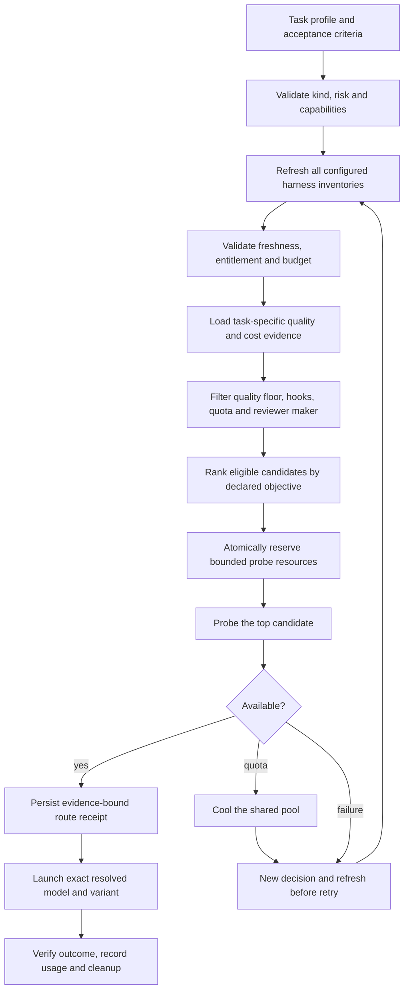

# Automatic task and model selection

Status: implemented 2026-10-09 as `rein route auto` (this document remains the contract; "Implementation status" at the end lists the code behind each section, the decisions taken where the design left room, and what is not delivered). Ordered chains (`rein route prepare`) are unchanged. Automatic selection is an explicit, separate prepare path that replaces manual chain/model selection; existing guarded launch, cooldown, budget and cleanup boundaries remain mandatory. No additional dependencies were needed.

## Coordinator input and deterministic classification

The coordinator reads the acceptance criteria, planned files, required tools and current model-ledger evidence. It submits a structured task profile bound to the contract/spec hash: kind, worker/review phase, claimed risk, required capabilities, expected context and rationale. The coordinator cannot supply a preferred model or reduce risk to obtain a cheaper model.

Example coordinator input (schema proposal, not a working CLI flag):

```json
{"phase":"worker","kind":"backend","risk_flags":["authorization"],"required_capabilities":["repository-edit","tests"],"rationale":[{"path":"src/auth.go","reason":"Changes authorization decisions"}]}
```

Reuse ledger kinds `backend`, `frontend`, `fullstack`, `docs`, `mechanical`; reviewing a backend task keeps kind=backend and uses phase=review. Rein validates classification against planned paths, spec requirements and project-sensitive rules. Missing/conflicting classification produces `classification_required`; unknown paths/risk cannot become a cheap mechanical task. A declared mechanical task requires a bounded operation and objective acceptance checks; substantive feature work does not qualify.

| Validated task | Worker candidate policy |
| --- | --- |
| Security-sensitive, production data or other T3 scope | high-risk |
| Backend logic or migrations | backend |
| UI/browser work | frontend |
| Documentation | docs |
| Bounded repetitive operations | mechanical |
| Cross-stack feature or general glue | ordinary |

Use `tier.EvaluateFromAllowGlobs` and `EvaluateFromChangedFiles` to enforce the project-sensitive minimum tier; actual changes can escalate it. Policy also checks required tools, modalities, context, sandbox/hook support and model capabilities. Static path rules do not claim to understand every semantic security risk; uncertain classification stops for refinement by the coordinator. Review uses a maker-independent approved candidate policy and actual worker model identity. Harness identity alone is insufficient: Claude through Kiro is still Anthropic.

## Refresh before every selection

Every automatic prepare, retry or fallback begins a new decision ID and invokes discovery for each configured harness/account/project. A previous decision snapshot cannot authorize a new selection. Metadata adapters may run concurrently; they do not infer against every model. Record adapter/executable version, scope fingerprint, query time, upstream evidence time or unknown, source/hash, complete/partial status, model IDs/variants, capabilities, billing mode, native units and observed limits. Never store credentials in artifacts.

A new local query is not proof of a remotely refreshed catalog. Explicitly distinguish `remote_verified`, `client_catalog` and `unknown`; automatic policy must declare which freshness class it accepts. Revalidation with a provider-supported cache validator is acceptable; a failed refresh must not silently reuse a prior snapshot. Exclude the failed/unproven harness, continue with other freshly eligible harnesses, and stop if none meet the policy. Cached prices/quality may be revalidated within their stated evidence lifetime, but their timestamps must not be replaced with discovery time. Expired quality requires reevaluation, not a metadata-only timestamp update.

| Harness | Adapter surface | Required boundary |
| --- | --- | --- |
| Codex | Version-matched app-server `model/list`, full pagination; `account/rateLimits/read` | Account/client scope; no documented forced remote catalog refresh. Close owned app-server after collection. |
| Claude Code | Version-matched `/model` or documented account-scoped equivalent, if accessible without inference | Anthropic API catalog is not Claude-plan entitlement. No unattended complete catalog adapter was verified locally. Unsupported freshness excludes this harness from strict auto mode until resolved. |
| agy | `agy models`; documented `/usage` refresh where supported | Current models command does not prove remote catalog freshness; interactive quota access needs a bounded adapter and cleanup. |
| Kiro | Installed `kiro-cli chat --list-models --format json` | Preserve account/region governance, context and credit multiplier; unknown remaining balance stays unknown. |
| OpenCode V2 | Version-matched location-scoped `/api/model` or installed `opencode models` | Public/configured catalog is not proof all models are enabled or usable by this account. V1 refresh flags are unsupported on installed V2. |

Discovery never opens paid overages, changes account/default model, purchases credits or executes instructions embedded in catalog text. A small selected-candidate availability probe may run only within an explicit probe budget; it proves that candidate's usability, not completeness or freshness of the whole catalog. Refresh adapters own and close exactly the sessions/processes they create on success, error and cancellation.

## Quality score and eligibility

Quality is task-specific evidence, not a marketing/model-name rank. Key it by exact resolved model/version, harness configuration, effort, tools/context regime, task kind/risk, evaluation-suite version and provenance. Do not carry a predecessor's score to a new model or an unresolved alias. An `auto` model cannot serve as an exact reviewer identity.

For workers, a successful attempt requires objective acceptance gates plus an exact-revision independent review, no unresolved high/blocker, no false completion claim or contract drift. Track all settled attempts, including failed and repaired ones; count verified successes, not only approved rows. Missing outcomes/findings remain unknown and reduce evidence coverage. A successful `OK` availability probe supplies no quality evidence.

Display `Q = 100 * lower95(successes, complete_attempts)`, using the lower endpoint of a two-sided 95% Wilson interval (z=1.959963984540054) and exposing sample count, coverage, confidence and age. Insufficient samples or coverage produces `unqualified`, not Q=100 or Q=0. Reuse the configured quality floor and false-claim limit; make missing floors/configuration explicit rather than inventing model scores. Quality configuration must work without a spending-cap configuration.

The worker interval is `(p + z*z/(2*n) - z*sqrt(p*(1-p)/n + z*z/(4*n*n))) / (1 + z*z/n)`, with p=successes/n; n=0 is unqualified. Automatic policy requires explicit minimum complete attempts, evidence maximum age and `min_approval_rate` in (0,1]. Compare the interval endpoint to that rate; the displayed Q is percent, not the configured fraction. The existing `MaxFalseClaims` is an allowed count in the complete cohort, not a rate; unknown claim assessments cannot satisfy it. Critical outcome/review/defect fields require 100% cohort coverage; missing rows cannot disappear from the attempted-task denominator. Missing required policy values produce `quality_policy_required`. Move/reuse the existing quality-floor shape as a standalone selection policy so it does not depend on budget being enabled.

Reviewer quality instead measures detection of known realistic defects and false positives on frozen red/clean fixtures. Approval frequency is not reviewer quality. Reviewer Q is 100 times the minimum Wilson lower endpoint of defect-detection recall on known-defect fixtures and specificity on clean fixtures. Policy requires separate minimum counts for both fixture classes, minimum recall/specificity fractions, maximum adjudicated false-positive rate, evidence age and full critical-field coverage. These are configured requirements, not invented per-model values. A reviewer must meet its separate calibration floor and have a different known maker from the actual worker; availability and a cheap price cannot relax this gate.

A newly discovered model starts unqualified. A bounded calibration lane may qualify it using frozen representative fixtures, objective gates, an existing qualified independent reviewer and normal contracted-worktree cleanup. Calibration requires explicitly configured native-pool/cash/call caps and standing authorization; discovery alone never enrolls a model in paid experiments. If the cap is reached without sufficient evidence, keep it unqualified. An explicitly selected legacy policy baseline remains possible, but must report `selection_mode=baseline_insufficient_evidence`; it is not scored automatic selection.

## Cost evidence and selection objective

A worker is eligible only if the same refresh cycle contains at least one qualified, maker-independent reviewer with suitable capabilities, a usable pool and budget for the task. The eligible reviewer set and funding plan must also satisfy the tier's full review/maker-count requirements, not merely provide one reviewer; existing human merge approval stays outside automatic model selection. Evaluate feasible worker/reviewer pairs, binding exact variants and reviewer policy/configuration to forecasts; do not compare a worker cohort with a cheap reviewer to another cohort with a different review regime as if those costs were equivalent. Later review selection refreshes again and may rerank qualified reviewers; changed review requirements or unavailable reviewers block completion rather than silently relaxing the gate.

Default proposed objective: among quality-qualified worker/reviewer pairs, minimize expected resource cost per independently verified completed task. The user's quality-first or prepaid-quota preference can change ordering through a project policy; no undocumented weighted quality/price sum.

Cost includes attempts, failures, retries, context, worker/reviewer tokens, repair rounds, probes and attributed fallback work. Forecast by task kind/context/effort, with sample count, coverage and uncertainty. For a comparable observed cohort:

`cost_per_success = total_attributed_cost_of_all_attempts / verified_successes`

Zero successes or incomplete required costs produces an unavailable estimate, never zero cost. Shared routing/discovery overhead is recorded separately with an allocation rule so it is not charged twice. Public rates refresh/revalidate against their source; use input/output/cache/context-tier rates where applicable. A blended legacy token rate is insufficient for accurate automatic billing comparison.

Keep monetary marginal cost, subscription allocation and native quota consumption separate. USD, Kiro credits, agy credits and subscription-limit percentages are not interchangeable. Each credit/cap is qualified by provider/account/pool/window. A subscription's prepaid cash cost does not mean unlimited or free remaining quota. API rates cannot silently become a Claude/Codex subscription invoice.

Cross-pool ranking requires a declared common comparison basis: measured monetary marginal cost, or an explicitly configured pool-to-resource-cost conversion with timestamp/provenance. Show any conversion as a policy estimate. Without a valid basis, rank only comparable candidates; return `cost_basis_required` if automatic selection cannot make a defensible cross-pool choice. Never silently choose a provider with unknown cost as cheapest. A known zero marginal cash price still must pass quality, quota and budget eligibility.

Balanced ordering: hard gates first, then lowest comparable cost-per-success; tie-break by higher quality lower bound, lower observed repair latency, then stable provider/model ID. Quality-first orders quality before comparable cost. Every choice reports the objective, evidence and excluded alternatives; it never claims price optimization across excluded unknown candidates.

## Decision and execution



Completion ends the current decision; each subsequent task starts from classification and a new refresh. Before any paid probe, atomically check and reserve its enforceable worst-case native-pool/cash/call bound together with the required worker/reviewer funding plan. If the adapter cannot enforce a finite probe bound or required cost conversion, return `probe_bound_required` without inference. Probe intent and reservation must precede execution. Settle measured usage afterward; unknown incurred usage is charged at the reserved upper bound, not released as zero. A crashed or unproven probe retains its reservation until reconciled.

Extend the existing receipt with task-profile, inventory, pricing, quality and policy hashes plus decision ID. Validate these alongside contract/config/hash, exact worktree, Run and hook generation at launch. Receipt expiration is the earliest evidence expiry. If stale at launch, reprepare; do not mutate a running task's model behind its back. Validate actual model identity before accepting evidence if the harness resolves or substitutes aliases. Same-task exclusive execution and per-pool budget reservations must be atomic; consumed usage settles reservations, while crashes retain conservative reservations until proven exited and incurred usage is reconciled (or conservatively charged). This prevents concurrent decisions from each spending the same remaining quota.

The coordinator consumes returned agent/model/effort/launch unchanged. It cannot override scored ordering by passing a different chain. Fallback goes through refresh and the same quality/cost gates; it cannot downgrade a review or sensitive task because a stronger pool ran out. Existing execution records remain distinct from task completion, review, human merge approval and cleanup proof.

## Implementation boundary and acceptance tests

Reuse `internal/providers` for version-aware discovery, `internal/routing` for classification/eligibility/ranking/receipt, `internal/ledger` for strict attributable evidence, `internal/budget` for pool-qualified caps/reservations, existing tier/hook/cleanup paths, and `cmd/rein` callers. Add one automatic prepare entry point; avoid a second scheduler, provider framework or dependency. Exact public flags are chosen during implementation, not presented here as working commands.

1. Every selection/retry/fallback invokes discovery; previous snapshots cannot authorize it. Partial pagination, invalid schema, failed refresh and unsupported freshness exclude a harness. Process/session cleanup is tested on all exits.
2. T3 scope cannot become mechanical/cheap; ambiguous classification and missing required capabilities fail closed. Review remains task-specific and maker-independent.
3. Missing defect/outcome fields, thin data, stale evidence, new model/alias/effort changes and inflated approval-only reviewer scores cannot qualify a model.
4. Failed attempts, repairs, review and probe costs count once. USD and unrelated credits cannot be merged. Unknown/partial/zero-success cost cannot win as free.
5. A lower-cost qualified model wins balanced mode; quality-first differs as declared. Stable tie-breaks and all exclusions are recorded. New calibration obeys fixed caps and stops unqualified at exhaustion.
6. A failed top candidate causes a new refresh and reranking without weakening the original floor; a quota failure additionally cools the shared pool. No automatic paid overage or unscored baseline substitution.
7. Price/catalog/quality/policy/contract changes invalidate receipts; actual-model substitution cannot inherit the chosen model's score or reviewer maker.
8. Concurrent decisions cannot double-reserve quota or run two writers on one checkout. Crash/unknown liveness does not release resources or reservations. Linux/macOS Go, advisor and cleanup CI stay required; Windows CI is currently excluded by user instruction.

## Verified discovery and sources

Local read-only checks on 2026-10-09, repeated while implementing the adapters (no inference, no calibration): Codex 0.162.0 `model/list` returned 7 picker-visible models (3 pages at page size 3) plus a weekly rate-limit window, and its owned app-server exited 0 when stdin closed. Kiro 2.21.0 JSON returned 21 entries with native credit metadata and context windows. agy 1.3.2 returned 18 rows. OpenCode 2.0.20 is location-scoped and unstable on first contact: the first `opencode models` call for a new location returned nothing, and the list moved between 543 and 497 entries before settling, so one answer is not a catalog (the adapter requires two agreeing non-empty answers and otherwise reports a partial inventory; it must also read stdout through a pipe, because the CLI prints nothing to a regular file). Claude Code 2.1.295 offers no non-inference catalog. These are local discovery results, not proof that all returned models are entitled, remotely refreshed or qualified. Opt-in live check: `REIN_DISCOVER_LIVE=1 go test ./internal/providers -run TestLiveHarnessesOptIn -v`.

Official references:
- [Codex app-server model/list and rateLimits](https://developers.openai.com/codex/app-server/).
- [Claude model configuration and policy restrictions](https://code.claude.com/docs/en/model-config); [Claude plan usage modes](https://support.claude.com/en/articles/15036540-use-the-claude-agent-sdk-with-your-claude-plan).
- [Antigravity headless model listing](https://www.antigravity.google/docs/cli/headless/) and [quota refresh](https://antigravity.google/docs/cli/commands/usage).
- [Kiro models and credit multipliers](https://kiro.dev/docs/models/) and [enterprise model governance](https://kiro.dev/docs/cli/enterprise/governance/model/).
- [OpenCode V2 location-scoped model API](https://dev.opencode.ai/v2/docs/api/model/v2-model-list/) and [catalog composition](https://opencode.ai/v2/docs/models).

## Implementation status

Handover for whoever continues this work (state at 2026-10-09, how to re-verify, open items, gotchas): [ROUTE_AUTO_HANDOVER.md](ROUTE_AUTO_HANDOVER.md).

Delivered, by design section:

| Design section | Code |
| --- | --- |
| Coordinator input and deterministic classification | `internal/routing/classify.go`: strict `TaskProfile` decoding (no field can name a model, provider, harness, chain or effort), validation against the contract hash, allow/deny globs, project-sensitive paths (`tier.EvaluateFromAllowGlobs` / `EvaluateFromChangedFiles`), risk vocabulary; refusals are `classification_required` / `profile_invalid` |
| Refresh before every selection | `internal/providers/discover.go`: version-matched adapters for Codex (app-server JSON-RPC, paginated `model/list`, `account/rateLimits/read`), Kiro, agy and OpenCode; Claude is `unsupported`; process-group cleanup on success, error, timeout and cancellation; `routing.PrepareAuto` discovers again for every decision, retry and fallback |
| Quality score and eligibility | `internal/ledger/evidence.go` (Wilson lower bound, cohort keys, quarantine of substituted/alias models, reviewer fixtures), `internal/routing/rank.go` (`qualifyWorker`, `qualifyReviewer`), `internal/contract/selection.go` (owner policy, `quality_policy_required`) |
| Cost evidence and selection objective | `internal/ledger/cost.go` and `rates.go` (attributed charges counted once, native units never merged, public rates with provenance), `internal/routing/rank.go` and `candidates.go` (declared cost basis, `cost_basis_required`, balanced and quality-first ordering, worker/reviewer pairing) |
| Decision and execution | `internal/routing/auto.go` (decision loop, baseline order), `diff.go` (a review's real changes), `internal/budget/reserve.go` (atomic probe + funding reservations, review hand-over, crash retention), `internal/routing/receipt.go` (hash-bound receipts, earliest-evidence expiry), `lease.go` (single-use receipts, one writer per checkout, Orca-dispatched leases), `settle.go`, `cmd/rein/route_auto.go`, `cmd/rein/route_launch.go` (effort binding, lease, attributable launch rows), `internal/guard/coord_bash.go` (owner configuration the coordinator cannot redirect) |

Acceptance tests 1-8 are covered by `internal/routing/auto_test.go`, `rank_test.go`, `classify_test.go`, `internal/providers/discover_test.go` and `discover_unix_test.go`, `internal/ledger/evidence_test.go`, `internal/budget/reserve_test.go`, `internal/run/lock_test.go` and `cmd/rein/route_auto_test.go` (end to end through the CLI). Each rule was also checked by mutation: breaking the rule turns a named test red.

Decisions taken where the design left room:

- The candidate SET comes from the configuration (`worker_chains[<policy>]`, and the union of `review_chains`); the chain ORDER is ignored. A newly discovered model that is not configured is never a candidate. Policy names are the keys of the example config: `high-risk`, `backend`, `frontend`, `docs`, `mechanical`, `ordinary`.
- A worker is eligible only with a qualified, maker-independent reviewer set in the same refresh that meets the tier's maker count (T3: two distinct makers). One `route auto --phase review` call selects ONE reviewer; for T3 the next call names the maker that already reviewed in `exclude_makers`, which can only narrow the candidates. The worker identity a review is judged against is taken from the ledger's records, not from the coordinator (`resolved_model` of the outcome, else the launched model unless it is an alias); the coordinator's `--worker-model` may only agree with it.
- Evidence is keyed by agent, exact model, effort, a configuration fingerprint (launch route, capabilities, context window), task kind, risk tier and the policy's `evaluation_suite`. A success needs passed gates, an approval at a recorded `review_sha` by an independent known maker, and zero blockers, highs, false claims and drift. Unknown fields lower coverage; qualification needs 100% coverage. A launched attempt whose launcher died without an outcome still counts, as unknown. Nothing heals an attempt afterwards: a receipt launched twice is incomplete, and a model substitution stays on the record even if a later correction omits `resolved_model` (outcome rows that disagree about the model that ran yield no worker identity at all).
- Cost per verified success is MEASURED from `kind=cost` ledger rows (worker, repair, probe and fallback charges of every settled attempt, over verified successes). Review cost is priced per reviewer provider (its entry in `fallback-chain.json`: one harness, model and effort; a review charge must name it) and added per expected review round, which binds the forecast to the review regime. Review charges are pooled across the tier and kind they were incurred on. The funding plan reserved for a task is the largest observed attempt plus the largest observed review charge per allowed review round. Rates (`prices.json` entries with `source`, `as_of`, `valid_until`) price API calls at the moment a charge is recorded (`rein ledger charge --price-key`) and gate API-billed candidates; the legacy blended `usd_per_mtok` is never used for scored selection.
- Cross-pool comparison needs `selection.cost_basis`: `monetary_marginal` (USD as measured; subscription and free pools are a known zero cash price, still subject to quota gates; a pool in credits or another native unit has no measured cash price there, so such a candidate is left out of a balanced comparison and reported as `cost_basis_unknown`) or `converted` (explicit per-pool conversions with source, date and validity). Without one, only candidates drawing on the same single pool are comparable; balanced mode with more is `cost_basis_required`. Quality-first ordering never needs a basis.
- One `budget.Reserve` holds the probe bound together with the funding plan, in three kinds of item: `probe`, the attempt's own `funding`, and for a worker the `review_reserve` it sets aside for the reviews that follow. The review reserves under its OWN attempt (`review_funding`) and takes the worker's `review_reserve` over in the same transaction, so review capacity is neither counted twice nor lost, and review spend is never booked as the worker's. A probe that does not become a launch is charged at its declared bound and its funding is released. `rein route settle --attempt` charges the probe at its bound; funding is charged at the reserved bound unless the attempt has a measured, non-zero charge of its own kind in that pool (a zero or approximate charge proves nothing; unknown usage is never released as zero), the review capacity is released, and a plan whose receipt was never used releases its funding uncharged. Preparing again does the same for a receipt that was never used; if the receipt cannot be written after a probe came up, the probe is charged once and the plan released. A receipt is single-use: `route launch` and `route check --phase review` spend it. A worker dispatched through Orca keeps the task held until `route settle` ends the attempt. A hold whose owner crashed is released only by the user (`rein route reconcile`), and only once the owner is proven gone and the task has no writer left.
- The explicit baseline (`selection.baseline_chain`) applies when no candidate qualified, only to candidates blocked by missing evidence (never to one disqualified on its record or excluded by any other gate), and never after a scored candidate failed. It runs through the scored path (refresh, gates, probe bound, atomic reservation, probe, receipt validation) and relaxes worker quality evidence only. It still requires complete measured worker cost and a qualified, funded reviewer plan for the tier; otherwise it refuses. It reports `selection_mode=baseline_insufficient_evidence`. Its launches still record attributable evidence, so the models can qualify later.
- Once a selection policy exists, `rein route prepare` (a coordinator-chosen chain) is refused unless the owner sets `selection.allow_manual_chains`, so the scored ordering cannot be bypassed by passing a different chain. Receipt validation at `route check` and `route launch` is unchanged.
- Classification fails closed: the owner's profile (or the contract's copy) must declare `sensitive_paths`, otherwise rein cannot tell sensitive code from ordinary code and refuses to choose; a risk flag outside the vocabulary is refused for every kind; `docs` means documentation files, not a directory called `docs`. For a review the tier follows the checkout's real changes (`git diff <base>...HEAD` plus uncommitted and untracked files), united with the coordinator's list, which can only add to it.
- The policy is the owner's `REIN_PROFILE`, else the contract's copy (the report says which: `policy_source`). The coordinator guard denies setting or unsetting `REIN_PROFILE`, `PIPELINE_LEDGER`, `PIPELINE_PRICES`, `PIPELINE_CONTRACTS`, `PIPELINE_FALLBACK`, `REIN_RUN_DIR` and `env -i`, and `--config` on `rein route`. Reviews are only offered on harnesses `advise.sh` can run (codex, kiro, claude) and run at the prepared effort (`route check --effort`, `ADVISE_EFFORT`). A configured effort must be one the fresh catalog lists for the model, and the usable context is the smaller of the configured and the catalogued window.
- Trust model: the ledger is writable by the coordinator, so outcome fields, charges, fixtures and the `changed_files`/`exclude_makers` lists are recorded assertions, not facts rein verified. Rein enforces that unknown is never success or zero, that a model's record is its own, and that the coordinator cannot name a model, weaken the owner's policy, skip the refresh or reuse a receipt; it cannot stop a hostile coordinator from forging its own ledger entries. Merge approval stays with `rein verdict check` and `rein approve`.
- The calibration gate (`rein route calibrate`) reserves ONE capped calibration call within `selection.calibration` (standing authorization, call, per-pool and cash caps); at exhaustion the model stays unqualified. For an enabled review provider, the hold freezes provider/model/effort/config so the first measured reviewer charge can be recorded through `rein ledger charge --component review` and settled without charging the reserved bound twice.

Not delivered, and known limits:

- Claude Code has no verified unattended catalog adapter, so its inventory is `unsupported` with freshness `unknown`. It is usable only when the policy lists `unknown` in `accept_freshness`, and then the availability probe is its only proof.
- No adapter proves `remote_verified` freshness (no provider cache validator is used). A policy that accepts only `remote_verified` selects nothing until one exists. The agy `/usage` quota refresh and the OpenCode V2 `/api/model` route (enabled flags, cost tiers) are not implemented; unknown balances stay unknown.
- The calibration RUNNER is not implemented. Frozen fixtures are judged by the existing pipeline and recorded with `rein ledger fixture`; the gate only bounds the spend.
- The cost forecast is the cohort's measured mean per verified success plus the planned reviews' per-review mean, keyed by kind, tier, effort and configuration; it is not conditioned on the task's context size and carries no uncertainty interval (the report shows the sample counts and coverage). Shared overhead (discovery, routing) is reported once with the decision and excluded from every cohort, without an allocation rule.
- The owner's policy is not pinned at `rein run start`: a coordinator that can set `REIN_PROFILE` outside the guarded Bash tool (or a profile that is absent, so the contract's copy applies) is the remaining way to supply a policy. Reviewer calibration fixtures and worker outcomes are recorded by whoever ran them (see the trust model); `review_sha` and the reviewer are not cross-checked against `rein verdict` records, because an attempt carries no MR number.
- A zero or approximate charge is never treated as measured, so a pool that is genuinely free is charged its reserved bound at settlement; settle with a real charge to release it.
- Rates are not refreshed from their sources automatically. An expired or provenance-less rate card removes the API-billed candidate until the owner updates `prices.json`.
- `spec_hash` in a task profile is recorded, not verified. Sandbox support is modelled by declared capability strings and the installed guard hook, not separately.
- A discovery adapter cannot kill descendants on Windows (no job object); Windows CI remains excluded by user instruction, while Linux/macOS Go, advisor and cleanup CI stay required. `GOOS=windows go vet ./...` is clean.
- Task lease and process-liveness proofs use pid plus start time (`run.ProcStart`); they are Linux/macOS only. Legacy `rein route prepare` receipts take no lease.
